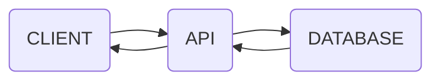

An API is a set of rules that let's one program talk to another for information or to tell it
to do something. APIs work behind the scenes, to computers it looks like an easy to use interface to communicate with each other, to humans it looks like a wall of code.

>[!NOTE]
>APIs can be built in any programming language that supports internet based
communication. All RESTful services are APIs but not all APIs are RESTful.

APIs use a three-tier architecture in most scenarios, you have a client that makes a
request to a server and the API is the one who delivers that request and returns you
the response. Kind of like how you order at a restaurant.

The customer is the client, the waiter is the API and the chef is the server, if you order
something the waiter tells the chef to prepare it and then the waiter gives you your
order when its done, you pay and leave.

>[!NOTE]
>APIs are just a way for any two pieces of software to swap data. They don't even need the internet. You just need two computers and a way for them to talk to each other, the way they talk is the API.

## Skyscanner 

Skyscanner, a website that lists all available tickets to various flights shows how a RESTful API works in the real world. When you search for flights, Skyscanner doesn’t keep every airline’s prices in its own database.

Instead, it fires off a quick REST-style message (an API request) to each airline’s server and each airline’s server replies with its current data, and Skyscanner simply gathers all the answers into one neat list for you. One request, many answers, all over standard web links. that’s the power and simplicity of RESTful APIs.

----
